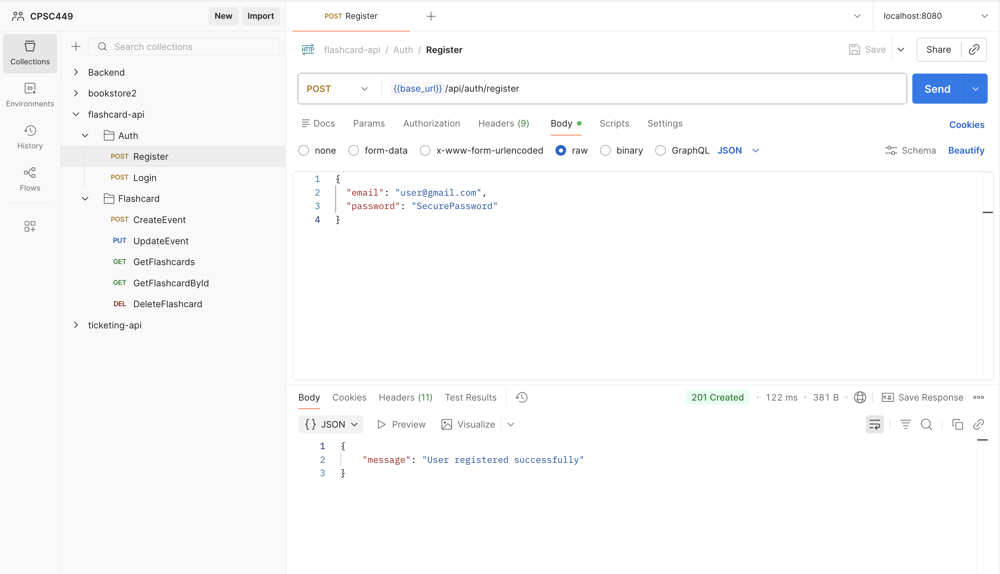
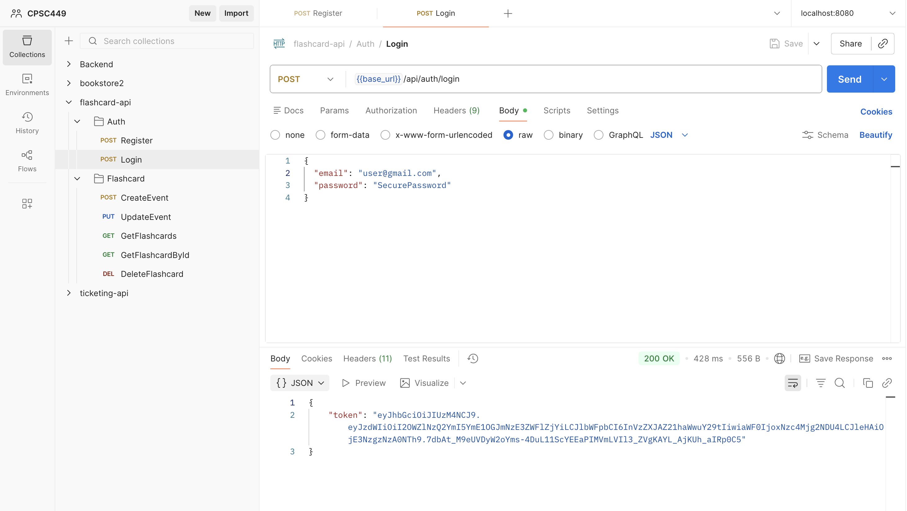
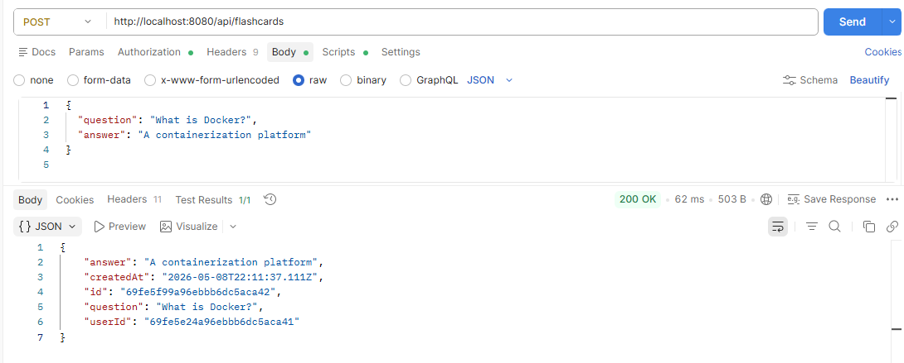
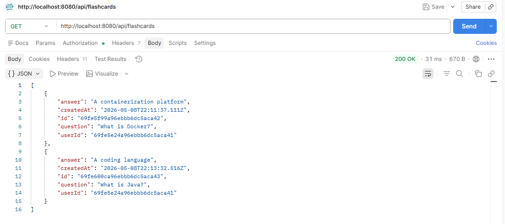
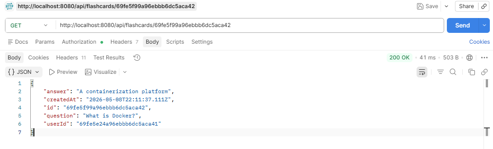
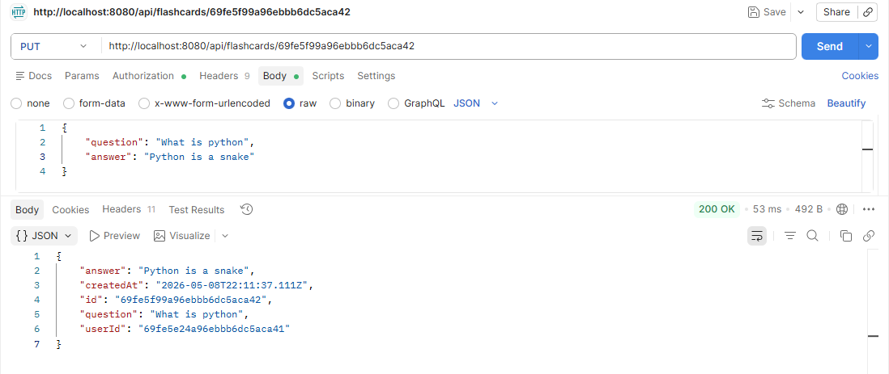
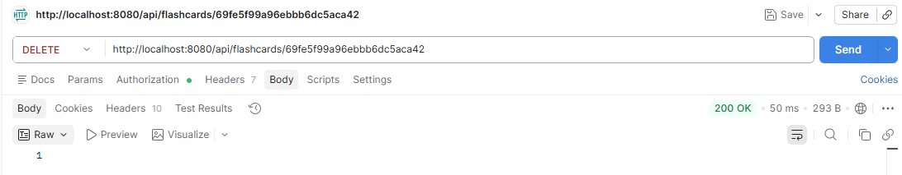

# Flashcard API
**CPSC 449 — Web Backend Engineering**
California State University, Fullerton

---

## Team Members

* Maans Zellman — CWID: 848759148
* Max Linghag Ahlgren — CWID: 808955363

---

## Overview

Flashcard API is a RESTful web service built with Spring Boot that allows users to create, read, update, and delete flashcards. The application uses MongoDB for data storage and supports JWT-based authentication.

---

## Technologies Used

* Java 21
* Spring Boot
* Spring Web MVC
* Spring Data MongoDB
* Spring Security
* JSON Web Tokens (JWT)
* Maven
* Docker v27/28/29

---

## Prerequisites

Before running the application, ensure you have the following installed:

* Docker
* MongoDB (running locally on port 27017)

---

## Project Structure

* `src/` — Application source code
* `pom.xml` — Maven configuration
* `Dockerfile` — Container build instructions

---

## Build Instructions

To build the Docker image:

```bash
docker build -t flashcard-api:1.0 .
```

---

## Run Instructions

### 1. Ensure MongoDB is running locally

Default configuration:

* Host: localhost
* Port: 27017
* Database: flashcardstore

### 2. Run the Docker container

```bash
docker run -d \
  --name flashcard-api \
  -p 8080:8080 \
  -e SPRING_DATA_MONGODB_URI=mongodb://host.docker.internal:27017/flashcardstore \
  flashcard-api:1.0
```

---

## API Endpoints

Base URL:

```
http://localhost:8080/api
```
### Register User 

* **POST /auth/register**
* Request Body:

```json
{
  "email": "user@gmail.com",
  "password": "SecurePassword"
}
```

### Login User

* **POST /auth/login**
* Request Body:

```json
{
  "email": "user@gmail.com",
  "password": "SecurePassword"
}
```


### Create Flashcard (/flashcards)

* **POST /**
* Request Body:

```json
{
  "question": "What is Docker?",
  "answer": "A containerization platform"
}
```


### Get All Flashcards 

* **GET /flashcards**


### Get Flashcard by ID 

* **GET /flashcards/{id}**


### Update Flashcard

* **PUT /flashcards/{id}**
* Request Body:

```json
{
  "question": "Updated question",
  "answer": "Updated answer"
}
```


### Delete Flashcard

* **DELETE /flashcards/{id}**

---

## Stopping & Deleting the Container

```bash
docker stop flashcard-api
docker rm flashcard-api
```

---